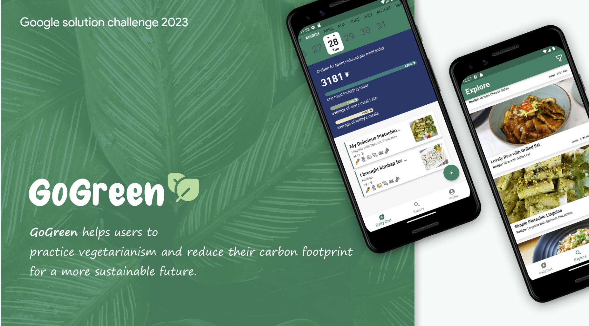

# Introduction

**Google Solution Challenge**는 실제 문제를 해결하며 혁신하고, 배우고, 영향력을 발휘할 수 있는 특별한 기회입니다. 학생들이 Google 기술을 활용하여 유엔이 설정한 17개 지속가능발전목표(SDGs) 중 하나를 위한 혁신적인 솔루션을 만드는 글로벌 해커톤입니다.

2020년에 처음 시작하여 **110개국 이상, 1,000개 이상의 챕터에서 4,000건 이상의 프로젝트가 출품된 GDG의 가장 큰 글로벌 이벤트**입니다.

2025 솔루션 챌린지의 자세한 사항은 아래 링크를 참고해주세요.

# GDGoC KU

**GDGoC KU** 역시 Solution Challenge에 매년 활발하게 참여하고 있으며, 많은 팀이 수상의 영예를 얻었습니다!

## Solution Challenge 2025

- 
    - **Guardy - Top 10 : [https://github.com/JiuBaek/guardy](https://github.com/JiuBaek/guardy)**
    - 백지우, 김보민, 문유빈, 조혜원
- 

## Solution Challenge 2024

- 
    - **RememVR - Top 100 : [https://github.com/RememVR-2024-SolutionChallenge](https://github.com/RememVR-2024-SolutionChallenge)**
    - 우귀정, 변서연, 최진우, 김서영
- 

## Solution Challenge 2023

- 
    - **Wonder - Top 10 : [https://github.com/KUGODS-Wonder/Wonder](https://github.com/RememVR-2024-SolutionChallenge)**
    - 박찬호, 김기오, 김보영, 백서경
- 
    - **Phopes - Top 100 : [https://github.com/GSC2023-Reducer/phopes](https://github.com/RememVR-2024-SolutionChallenge)**
    - 최진우, 양윤지, 윤석현, 김준형
- 
    - **GoGreen - Top 100 : [https://github.com/KU-Solution-Challenge-GoGreen/GoGreen](https://github.com/KU-Solution-Challenge-GoGreen/GoGreen)**
    - 김규민, 김예진, 조재건, 하채영

